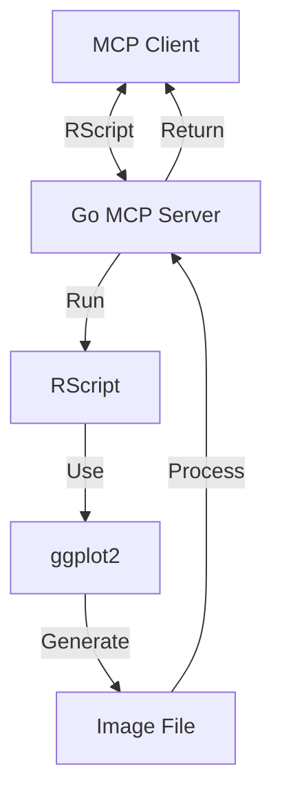
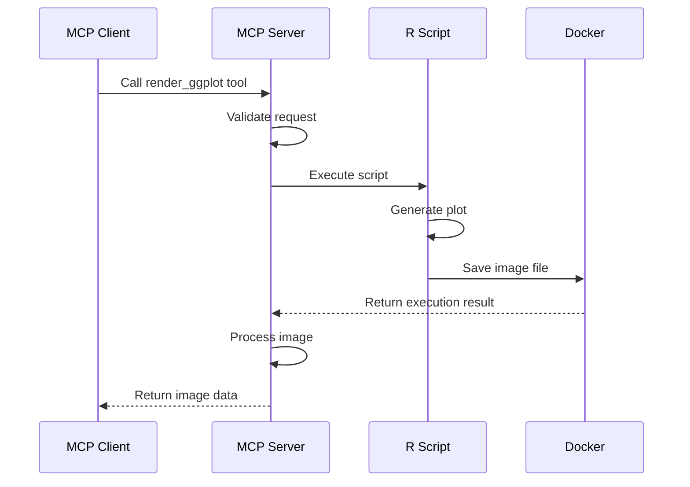
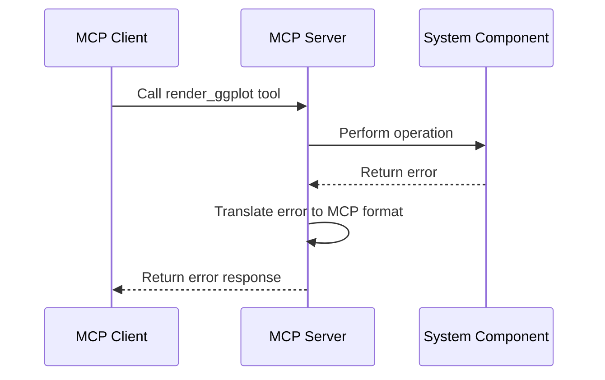
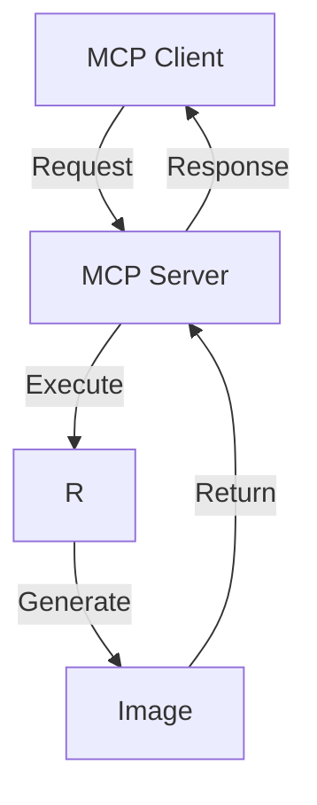

# R-Server MCP for ggplot: Architecture Document

## 1. System Overview

The R-Server MCP for ggplot is a specialized server that implements the Model Context Protocol (MCP) to provide ggplot2 visualization capabilities to AI models. The system consists of several key components that work together to receive visualization requests, execute R code, and return the generated images.



## 2. Component Architecture

### 2.1 MCP Server

The MCP Server is the core component that handles communication with clients using the Model Context Protocol. It is implemented in Go using the metoro-io/mcp-golang library.

**Responsibilities:**
- Implement MCP protocol handlers
- Validate incoming requests
- Register and expose the render_ggplot tool
- Coordinate the execution of R scripts
- Process and return results

**Key Classes:**
- `MCPServer`: Main server class that implements the MCP protocol
- `GGPlotTool`: Implementation of the render_ggplot tool

### 2.3 Docker Integration

The whole project should be run in a Docker container for security.

Individual calls to Render should be put in their own directories and data should be wiped after returning. 

### 2.4 Image Processor

The Image Processor handles the processing and conversion of generated images.

**Responsibilities:**
- Read image files from disk
- Convert between image formats if needed
- Optimize images for transmission
- Handle image metadata

**Key Classes:**
- `ImageProcessor`: Processes and converts images
- `ImageFormat`: Defines supported image formats and conversion options

## 3. Data Flow

### 3.1 Request Processing Flow

1. **Client Request**: The client sends an MCP request to call the render_ggplot tool with R code and parameters
2. **Request Validation**: The server validates the request parameters. Ensure that the R script does not contain malicioius instructions. 
3. **R Execution**: The server executes the R script
4. **Image Generation**: The R script generates an image file
5. **Image Processing**: The server processes the image file
6. **Response Creation**: The server creates an MCP response with the image data
8. **Client Response**: The response is sent back to the client
9. 



### 3.2 Error Handling Flow

1. **Error Detection**: An error occurs during processing
2. **Error Capture**: The error is captured and logged
3. **Error Translation**: The error is translated into an MCP error response
4. **Client Notification**: The error response is sent to the client



## 4. API Specification

### 4.1 MCP Tool: render_ggplot

**Description**: Renders a ggplot2 visualization from R code

**Input Schema**:
```json
{
  "type": "object",
  "properties": {
    "code": {
      "type": "string",
      "description": "R code containing ggplot2 commands"
    },
    "output_type": {
      "type": "string",
      "enum": ["png", "jpeg", "pdf", "svg"],
      "description": "Output format for the image",
      "default": "png"
    },
    "width": {
      "type": "integer",
      "description": "Width of the output image in pixels",
      "default": 800,
      "minimum": 100,
      "maximum": 5000
    },
    "height": {
      "type": "integer",
      "description": "Height of the output image in pixels",
      "default": 600,
      "minimum": 100,
      "maximum": 5000
    },
    "resolution": {
      "type": "integer",
      "description": "Resolution of the output image in dpi",
      "default": 96,
      "minimum": 72,
      "maximum": 600
    }
  },
  "required": ["code"]
}
```

**Output**:
- For successful requests: Image data in the specified format
- For failed requests: Error message with details

**Example Request**:
```json
{
  "name": "render_ggplot",
  "arguments": {
    "code": "ggplot(mtcars, aes(x = mpg, y = hp)) + geom_point() + theme_minimal() + labs(title = 'MPG vs Horsepower')",
    "output_type": "png",
    "width": 800,
    "height": 600,
    "resolution": 96
  }
}
```

**Example Response (Success)**:
```json
{
  "content": [
    {
      "type": "image",
      "mimeType": "image/png",
      "data": "base64-encoded-image-data"
    }
  ]
}
```

**Example Response (Error)**:
```json
{
  "content": [
    {
      "type": "text",
      "text": "Error executing R code: object 'non_existent_data' not found"
    }
  ],
  "isError": true
}
```

## 5. Technology Stack

### 5.1 Core Technologies

| Component | Technology | Justification |
|-----------|------------|---------------|
| Server Implementation | Go | Performance, concurrency, strong typing |
| MCP Protocol | metoro-io/mcp-golang | Established library for MCP implementation |
| Visualization | R + ggplot2 | Industry standard for statistical graphics |
| Containerization | Docker | Isolation, reproducibility, security |
| Image Processing | Go standard library | Native integration, performance |

### 5.2 Development Tools

| Tool | Purpose | Justification |
|------|---------|---------------|
| Task | Task runner | Go-based, simple, powerful |
| VSCode | IDE | Excellent Go and Docker integration |
| Go test | Testing | Native Go testing framework |
| golangci-lint | Linting | Comprehensive Go linter |

## 6. Security Considerations

### 6.1 R Code Execution

R code execution presents security risks, which are mitigated through:

1. **Docker Isolation**: All R code runs in isolated containers
2. **Resource Limits**: Containers have CPU, memory, and time limits
3. **No Network Access**: Containers run without network access
4. **Read-Only File System**: Containers use read-only file systems except for output directories
5. **Input Validation**: R code is validated before execution

### 6.2 Docker Security

Docker security is ensured through:

1. **Minimal Base Image**: Using a minimal R base image
2. **Non-Root User**: Running containers as a non-root user
3. **No Privileged Mode**: Never running containers in privileged mode
4. **Volume Isolation**: Carefully controlling mounted volumes
5. **Container Cleanup**: Removing containers after execution

## 7. Performance Considerations

### 7.1 Optimization Strategies

1. **Docker Image Caching**: Pre-build and cache Docker images
2. **R Package Preinstallation**: Include commonly used packages in the Docker image
3. **Parallel Execution**: Support for concurrent rendering requests
4. **Resource Allocation**: Appropriate CPU and memory allocation for containers
5. **Image Compression**: Optimize image size for transmission

### 7.2 Performance Targets

| Metric | Target | Measurement Method |
|--------|--------|-------------------|
| Request Processing Time | < 100ms | Server-side timing |
| R Script Execution Time | < 5s for typical plots | Container execution timing |
| Memory Usage | < 512MB per request | Container memory monitoring |
| Concurrent Requests | Support for 10+ simultaneous requests | Load testing |

## 8. Deployment Architecture



## 9. Future Considerations

### 9.1 Potential Enhancements

1. **Caching**: Implement caching for frequently requested visualizations
2. **Additional R Packages**: Support for additional visualization packages
3. **Interactive Visualizations**: Support for interactive plots (e.g., plotly)
4. **Advanced Customization**: More options for customizing visualizations
5. **Authentication**: Add authentication for secure access
